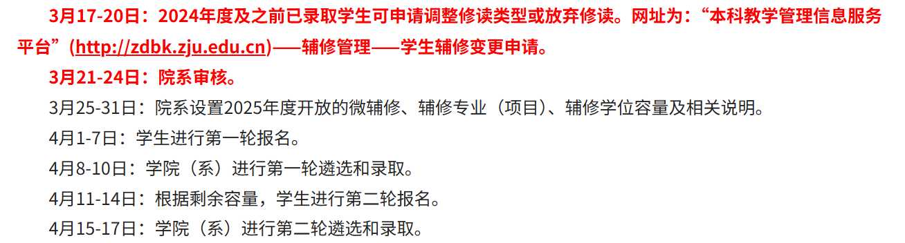

## 辅修
### 简介

辅修是指学生在修读并完成主修专业的同时，按照学校指定的辅修要求完成其他专业（项目）相应课程修读和相关教学环节，获得相应证书或学位的学习方式。

辅修的一般开设形式：

- 微辅修：一般是10-15个学分，内容为专业的几门最核心的课，授予微辅修证书，仅学校认证，无学信网认证。
- 辅修专业（或辅修项目）：一般是25-30个学分，内容为专业的大部分核心课程，授予辅修专业证书，仅学校认证，无学信网认证。
- 辅修学位：一般是50-70个学分，内容为专业的必修课，选修课，实践课以及毕业论文（设计），辅修学位在主修学士学位证书中予以注明，不单独发放辅修学位证书，学信网会予以认证。

>具体的辅修要求可以在各专业的培养方案中查询。申请辅修后，选课学分上限会上调至 40 学分，低定学分会上调至 27.5 学分。

### 时间安排

每年春夏学期开学初的时候，教务处会发布相关的辅修通知。

以 2025 年[辅修通知](https://bksy.zju.edu.cn/2025/0317/c28324a3027740/page.psp)为例，下面是辅修的相关时间安排

一般为三个主要流程：

1. 已申请辅修的同学可选变更辅修（只能调整修读类型或放弃修读，不可更改辅修专业）
2. 第一轮辅修报名申请及审核
3. 第二轮辅修报名申请及审核

### 申请流程

1. **第一轮申请**
	学生在本科教学管理信息服务平台上进行申请，仅能选择一个志愿，需选择XX年级XX专业XX形式，如报名“2024级金融学的微辅修”。
2. **第一轮筛选**
	院系对报名学生进行资格审核与考察筛选，筛选和录取方式由院系自行决定。
3. **第二轮申请及筛选**
	第1轮录取结束后，根据剩余容量，学生进行第2轮报名，院系再次筛选和录取。
	

辅修申请在本科教学管理信息服务平台中申请，具体路径为：辅修管理-学生辅修申请；如需修改或放弃申请，则路径为： 辅修管理-学生辅修变更申请。

在辅修报名时，该界面会显示所有开放辅修的专业及等级信息，同时会即时显示各年级各专业报名情况，报名辅修时需查阅辅修专业的“说明”文件，部分专业的文件中包含其对申请辅修的要求。每个学生每学年仅能申请成功一个专业或项目。

### 竺可桢学院辅修班

竺可桢学院开设3个辅修班级，分别为：
- 工程教育高级班（ACEE，简称工高班）：面向理工科学生，着重培养工程应用和设计能力
- 创新与创业管理强化班（ITP）：着重创新创业管理教育，培养未来企业家
- 公共管理强化班（UPA）：着重公共精神教育，培养公共管理人才

以上三个班级都有自己的报名方式和遴选时间，和一般的辅修具有较大差别。详情可关注相应班级公众号：浙大工高班ACEE、创新与创业管理强化班ITP、公共管理强化班UPA。

### 微专业

2025 年学校第一次开设微专业的报名，具体安排可见：[关于浙江大学2025年新设微专业报名的通知](https://bksy.zju.edu.cn/2025/0520/c28418a3053361/page.htm)。从要求来看，微专业对标的是微辅修，微专业课程主要以单独开班形式开展教学，完成微专业课程修读课获得相应的微专业证书，微专业学分可同时计入主修专业个性课程学分。

其申请方式和辅修相同，同样在本科教学管理信息服务平台的学生辅修申请中申请，每名学生最多可申请2个微专业。报名条件以各微专业要求为准。
